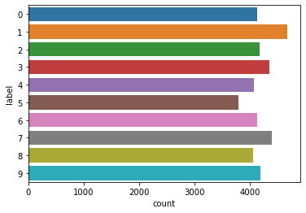
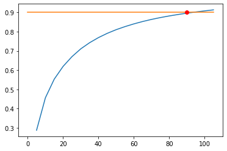
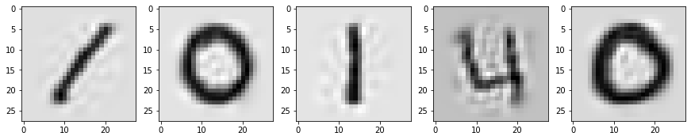
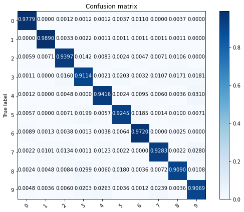
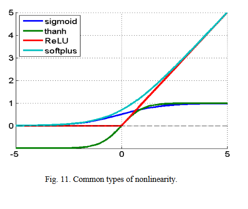
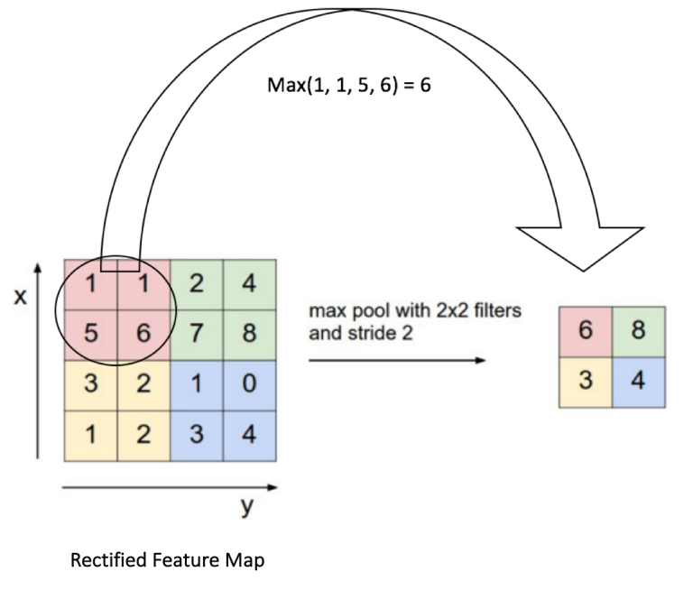
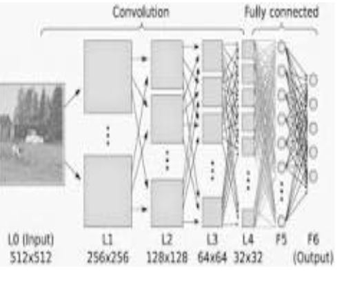

# **Digit Recognizer - Lept1**


```python
import sys

MODULE_FULL_PATH = '../Libraries'

sys.path.insert(1, MODULE_FULL_PATH)

from library import *
```


```python
from IPython.display import IFrame

IFrame(src='https://en.wikipedia.org/wiki/handwriting', width=700, height=500)
```


<iframe
    width="700"
    height="500"
    src="https://en.wikipedia.org/wiki/handwriting"
    frameborder="0"
    allowfullscreen
></iframe>


# Load the train data

Firstly, we must load the dataset. We use [Pandas](https://pandas.pydata.org/) . I load the dataset and convert the categorical non numeric features into numeric ones.


```python
train_data = pd.read_csv("train.csv", encoding="utf8")
```


```python
test_data = pd.read_csv("test.csv", encoding="utf8")
```


```python
with pd.option_context('display.max_rows', None, 'display.max_columns', None):  # more options can be specified also
    print(train_data.dtypes)
```

    label       int64
    pixel0      int64
    pixel1      int64
    pixel2      int64
    ...
    pixel782    int64
    pixel783    int64
    dtype: object


```python
train_data.head()
```


<div>
<style scoped>
    .dataframe tbody tr th:only-of-type {
        vertical-align: middle;
    }

    .dataframe tbody tr th {
        vertical-align: top;
    }

    .dataframe thead th {
        text-align: right;
    }
</style>
<table border="1" class="dataframe">
  <thead>
    <tr style="text-align: right;">
      <th></th>
      <th>label</th>
      <th>pixel0</th>
      <th>pixel1</th>
      <th>pixel2</th>
      <th>pixel3</th>
      <th>pixel4</th>
      <th>pixel5</th>
      <th>pixel6</th>
      <th>pixel7</th>
      <th>pixel8</th>
      <th>...</th>
      <th>pixel774</th>
      <th>pixel775</th>
      <th>pixel776</th>
      <th>pixel777</th>
      <th>pixel778</th>
      <th>pixel779</th>
      <th>pixel780</th>
      <th>pixel781</th>
      <th>pixel782</th>
      <th>pixel783</th>
    </tr>
  </thead>
  <tbody>
    <tr>
      <th>0</th>
      <td>1</td>
      <td>0</td>
      <td>0</td>
      <td>0</td>
      <td>0</td>
      <td>0</td>
      <td>0</td>
      <td>0</td>
      <td>0</td>
      <td>0</td>
      <td>...</td>
      <td>0</td>
      <td>0</td>
      <td>0</td>
      <td>0</td>
      <td>0</td>
      <td>0</td>
      <td>0</td>
      <td>0</td>
      <td>0</td>
      <td>0</td>
    </tr>
    <tr>
      <th>1</th>
      <td>0</td>
      <td>0</td>
      <td>0</td>
      <td>0</td>
      <td>0</td>
      <td>0</td>
      <td>0</td>
      <td>0</td>
      <td>0</td>
      <td>0</td>
      <td>...</td>
      <td>0</td>
      <td>0</td>
      <td>0</td>
      <td>0</td>
      <td>0</td>
      <td>0</td>
      <td>0</td>
      <td>0</td>
      <td>0</td>
      <td>0</td>
    </tr>
    <tr>
      <th>2</th>
      <td>1</td>
      <td>0</td>
      <td>0</td>
      <td>0</td>
      <td>0</td>
      <td>0</td>
      <td>0</td>
      <td>0</td>
      <td>0</td>
      <td>0</td>
      <td>...</td>
      <td>0</td>
      <td>0</td>
      <td>0</td>
      <td>0</td>
      <td>0</td>
      <td>0</td>
      <td>0</td>
      <td>0</td>
      <td>0</td>
      <td>0</td>
    </tr>
    <tr>
      <th>3</th>
      <td>4</td>
      <td>0</td>
      <td>0</td>
      <td>0</td>
      <td>0</td>
      <td>0</td>
      <td>0</td>
      <td>0</td>
      <td>0</td>
      <td>0</td>
      <td>...</td>
      <td>0</td>
      <td>0</td>
      <td>0</td>
      <td>0</td>
      <td>0</td>
      <td>0</td>
      <td>0</td>
      <td>0</td>
      <td>0</td>
      <td>0</td>
    </tr>
    <tr>
      <th>4</th>
      <td>0</td>
      <td>0</td>
      <td>0</td>
      <td>0</td>
      <td>0</td>
      <td>0</td>
      <td>0</td>
      <td>0</td>
      <td>0</td>
      <td>0</td>
      <td>...</td>
      <td>0</td>
      <td>0</td>
      <td>0</td>
      <td>0</td>
      <td>0</td>
      <td>0</td>
      <td>0</td>
      <td>0</td>
      <td>0</td>
      <td>0</td>
    </tr>
  </tbody>
</table>
<p>5 rows × 785 columns</p>
</div>


how many samples?


```python
train_data.pixel0.shape
```


    (42000,)


```python
test_data.pixel0.shape
```


    (28000,)


```python
sns.countplot(y='label', data=train_data)
```


    <AxesSubplot:xlabel='count', ylabel='label'>


    

    


## Extract the target


```python
y = train_data['label']
```


```python
y.head()
```


    0    1
    1    0
    2    1
    3    4
    4    0
    Name: label, dtype: int64


```python
y.shape
```


    (42000,)


# Features analysis

how much NaN value are there?


```python
with pd.option_context('display.max_rows', None, 'display.max_columns', None):  # more options can be specified also
    print (train_data.isnull().sum())
```

    label       0
    pixel0      0
    pixel1      0
    ...
    pixel782    0
    pixel783    0
    dtype: int64


```python
X=train_data.drop(columns=['label'])
```


```python
X.head()
```


<div>
<style scoped>
    .dataframe tbody tr th:only-of-type {
        vertical-align: middle;
    }

    .dataframe tbody tr th {
        vertical-align: top;
    }

    .dataframe thead th {
        text-align: right;
    }
</style>
<table border="1" class="dataframe">
  <thead>
    <tr style="text-align: right;">
      <th></th>
      <th>pixel0</th>
      <th>pixel1</th>
      <th>pixel2</th>
      <th>pixel3</th>
      <th>pixel4</th>
      <th>pixel5</th>
      <th>pixel6</th>
      <th>pixel7</th>
      <th>pixel8</th>
      <th>pixel9</th>
      <th>...</th>
      <th>pixel774</th>
      <th>pixel775</th>
      <th>pixel776</th>
      <th>pixel777</th>
      <th>pixel778</th>
      <th>pixel779</th>
      <th>pixel780</th>
      <th>pixel781</th>
      <th>pixel782</th>
      <th>pixel783</th>
    </tr>
  </thead>
  <tbody>
    <tr>
      <th>0</th>
      <td>0</td>
      <td>0</td>
      <td>0</td>
      <td>0</td>
      <td>0</td>
      <td>0</td>
      <td>0</td>
      <td>0</td>
      <td>0</td>
      <td>0</td>
      <td>...</td>
      <td>0</td>
      <td>0</td>
      <td>0</td>
      <td>0</td>
      <td>0</td>
      <td>0</td>
      <td>0</td>
      <td>0</td>
      <td>0</td>
      <td>0</td>
    </tr>
    <tr>
      <th>1</th>
      <td>0</td>
      <td>0</td>
      <td>0</td>
      <td>0</td>
      <td>0</td>
      <td>0</td>
      <td>0</td>
      <td>0</td>
      <td>0</td>
      <td>0</td>
      <td>...</td>
      <td>0</td>
      <td>0</td>
      <td>0</td>
      <td>0</td>
      <td>0</td>
      <td>0</td>
      <td>0</td>
      <td>0</td>
      <td>0</td>
      <td>0</td>
    </tr>
    <tr>
      <th>2</th>
      <td>0</td>
      <td>0</td>
      <td>0</td>
      <td>0</td>
      <td>0</td>
      <td>0</td>
      <td>0</td>
      <td>0</td>
      <td>0</td>
      <td>0</td>
      <td>...</td>
      <td>0</td>
      <td>0</td>
      <td>0</td>
      <td>0</td>
      <td>0</td>
      <td>0</td>
      <td>0</td>
      <td>0</td>
      <td>0</td>
      <td>0</td>
    </tr>
    <tr>
      <th>3</th>
      <td>0</td>
      <td>0</td>
      <td>0</td>
      <td>0</td>
      <td>0</td>
      <td>0</td>
      <td>0</td>
      <td>0</td>
      <td>0</td>
      <td>0</td>
      <td>...</td>
      <td>0</td>
      <td>0</td>
      <td>0</td>
      <td>0</td>
      <td>0</td>
      <td>0</td>
      <td>0</td>
      <td>0</td>
      <td>0</td>
      <td>0</td>
    </tr>
    <tr>
      <th>4</th>
      <td>0</td>
      <td>0</td>
      <td>0</td>
      <td>0</td>
      <td>0</td>
      <td>0</td>
      <td>0</td>
      <td>0</td>
      <td>0</td>
      <td>0</td>
      <td>...</td>
      <td>0</td>
      <td>0</td>
      <td>0</td>
      <td>0</td>
      <td>0</td>
      <td>0</td>
      <td>0</td>
      <td>0</td>
      <td>0</td>
      <td>0</td>
    </tr>
  </tbody>
</table>
<p>5 rows × 784 columns</p>
</div>


## SVD & PCA

First nomalize data


```python
from sklearn.preprocessing import StandardScaler, Normalizer
scaler = Normalizer()
X_scal=scaler.fit_transform(X)
```


```python
test_scal=scaler.transform(test_data)
```

iterate Truncated SVD varying the number of components to find variance 90%


```python
from sklearn.decomposition import PCA, TruncatedSVD
variance=[]
for component in range(5,110,5):
    svd = TruncatedSVD(n_components=component, n_iter=7, random_state=42)
    svd.fit(X_scal)
    variance.append(svd.explained_variance_ratio_.sum())
    #print (component)

```


```python
import matplotlib.pyplot as plt

plt.plot(np.arange(5,110,5),variance)
plt.plot([0,105],[0.90,0.90])
plt.plot(90,0.9,'ro')
for i in variance:
    if i >= 0.9:
        print('# of components for variance 0.9 = ',variance.index(i)*5)
        break
```

    # of components for variance 0.9 =  90


    

    


now calculate PCA the found number of components


```python
from sklearn.decomposition import PCA,TruncatedSVD
pca = PCA(n_components=90)
X_new=pca.fit_transform(X_scal)
```


```python
test_new=pca.transform(test_scal)
```

How many features?


```python
X_new.shape
```


    (42000, 90)


```python
X_tr=pca.inverse_transform(X_new)
```


```python
v = np.array(X_tr).reshape(-1, 28, 28, 1)/255

fig, ax = plt.subplots(1, 5, figsize=(15,8))
for i in range(5):
    ax[i].imshow(v[i], cmap='binary')
```


    

    


## Logistic Regression


```python
X_train, X_test, y_train, y_test = train_test_split(X_new, y,random_state=42,test_size=0.2)
```


```python
rf=training(X_train,y_train,p_name='digit',model='Random Forest')
```

    Fitting 5 folds for each of 100 candidates, totalling 500 fits


    [Parallel(n_jobs=-3)]: Using backend LokyBackend with 4 concurrent workers.
    [Parallel(n_jobs=-3)]: Done  33 tasks      | elapsed:    6.0s
    [Parallel(n_jobs=-3)]: Done 154 tasks      | elapsed:  1.7min
    [Parallel(n_jobs=-3)]: Done 357 tasks      | elapsed:  7.3min
    [Parallel(n_jobs=-3)]: Done 500 out of 500 | elapsed: 11.5min finished


```python
target_names=['0','1','2','3','4','5','6','7','8','9']
```


```python
predic = rf.predict(X_test)
confm = confusion_matrix(y_test, predic,normalize='true')
plot_confusion_matrix(confm,target_names)
```


    

    


```python
best_rf=rf.best_estimator_
best_rf.fit(X_new,y)
scores=cross_val_score(best_rf, X_new,y, cv=5,scoring=make_scorer(accuracy_score))
print("Accuracy: %0.2f (+/- %0.2f)" % (scores.mean(), scores.std() * 2))
```

    Accuracy: 0.94 (+/- 0.00)


## Convolutional Neural Network

I tried to use CNN with PCA with very bad results. It's reasonable, because CNN need to recognize pattern.

Let's summarize. The input of our neural network is a tensor with width=28, height=28 and depth=1 where $28 \times 28$ is the dimension of the image and $ 1 $ the colour channel.  

### First step = Convolution
Instead  of  a  full  connection,  it  is  a  good  idea  to  look  for  local  regions  in  the  picture  instead  of  in  the  whole  image. Another  assumption  for  simplification,  is  to  keep  the  local  connection  weights  fixed  for  the  entire  neurons  of  the  next  layer.  This  will  connect  the  neighbor  neurons  in  the  next  layer  with  exactly  the  same  weight  to  the  local  region  of  the  previous  layer.


In this case, the yellow matrix is the filter. 

### Second step = Non linearity
For many years, sigmoid and tanh were the most popular non-linearity. The following figure  shows   the   common   types   of   nonlinearity. 


### Third step = Pooling
Spatial Pooling (also called subsampling or downsampling) reduces the dimensionality of each feature map but retains the most important information. Spatial Pooling can be of different types: Max, Average, Sum etc.
Below an example of Max Pooling operation on a Rectified Feature map (obtained after convolution + ReLU operation) by using a 2×2 window.


### Fourth step = Fully connected
The Fully Connected layer is a traditional Multi Layer Perceptron that uses a softmax activation function in the output layer. The term “Fully Connected” implies that every neuron in the previous layer is connected to every neuron on the next layer. The output from the convolutional and pooling layers represent high-level features of the input image. The purpose of the Fully Connected layer is to use these features for classifying the input image into various classes based on the training dataset. 



```python
from tensorflow.keras.models import Sequential
from tensorflow.keras.layers import Dense, Activation, MaxPooling2D,Conv2D,Flatten
from tensorflow.keras.utils import to_categorical
import tensorflow as tf

from sklearn.ensemble import RandomForestClassifier
```


```python
X.shape
```


    (42000, 784)


```python
X=X.to_numpy()
X = X.reshape(-1, 28, 28, 1) 

```


```python
X.shape
```


    (42000, 28, 28, 1)


```python
test_data_cnn=test_data.to_numpy()
test_data_cnn=test_data_cnn.reshape(-1, 28, 28, 1) 
```


```python
model = Sequential()
model.add(Conv2D(32, (3, 3), activation='relu', input_shape=(28,28,1)))
model.add(MaxPooling2D((2, 2)))
model.add(Conv2D(64, (3, 3), activation='relu'))
model.add(MaxPooling2D((2, 2)))
model.add(Conv2D(64, (3, 3), activation='relu'))
model.add(Flatten())
model.add(Dense(64, activation='relu'))
model.add(Dense(10))


```


```python
model.summary()
```

    Model: "sequential_6"
    _________________________________________________________________
    Layer (type)                 Output Shape              Param #   
    =================================================================
    conv2d_18 (Conv2D)           (None, 26, 26, 32)        320       
    _________________________________________________________________
    max_pooling2d_12 (MaxPooling (None, 13, 13, 32)        0         
    _________________________________________________________________
    conv2d_19 (Conv2D)           (None, 11, 11, 64)        18496     
    _________________________________________________________________
    max_pooling2d_13 (MaxPooling (None, 5, 5, 64)          0         
    _________________________________________________________________
    conv2d_20 (Conv2D)           (None, 3, 3, 64)          36928     
    _________________________________________________________________
    flatten_6 (Flatten)          (None, 576)               0         
    _________________________________________________________________
    dense_12 (Dense)             (None, 64)                36928     
    _________________________________________________________________
    dense_13 (Dense)             (None, 10)                650       
    =================================================================
    Total params: 93,322
    Trainable params: 93,322
    Non-trainable params: 0
    _________________________________________________________________


### first run


```python
X_train, X_test, y_train, y_test = train_test_split(X, y,random_state=42,test_size=0.2)
```


```python
model.compile(optimizer='SGD',
              loss=tf.keras.losses.SparseCategoricalCrossentropy(from_logits=True),
              metrics=['accuracy'])

history = model.fit(X_train, y_train, epochs=10, 
                    validation_data=(X_test, y_test))
```

    Epoch 1/10
    1050/1050 [==============================] - 41s 39ms/step - loss: 0.4643 - accuracy: 0.8986 - val_loss: 0.1221 - val_accuracy: 0.9640
    Epoch 2/10
    1050/1050 [==============================] - 44s 42ms/step - loss: 0.1072 - accuracy: 0.9664 - val_loss: 0.0791 - val_accuracy: 0.9746
    Epoch 3/10
    1050/1050 [==============================] - 42s 40ms/step - loss: 0.0748 - accuracy: 0.9766 - val_loss: 0.0715 - val_accuracy: 0.9769
    Epoch 4/10
    1050/1050 [==============================] - 40s 38ms/step - loss: 0.0601 - accuracy: 0.9800 - val_loss: 0.0857 - val_accuracy: 0.9746
    Epoch 5/10
    1050/1050 [==============================] - 40s 39ms/step - loss: 0.0511 - accuracy: 0.9837 - val_loss: 0.1157 - val_accuracy: 0.9673
    Epoch 6/10
    1050/1050 [==============================] - 42s 40ms/step - loss: 0.0469 - accuracy: 0.9849 - val_loss: 0.0981 - val_accuracy: 0.9724
    Epoch 7/10
    1050/1050 [==============================] - 41s 39ms/step - loss: 0.0340 - accuracy: 0.9893 - val_loss: 0.0635 - val_accuracy: 0.9818
    Epoch 8/10
    1050/1050 [==============================] - 42s 40ms/step - loss: 0.0306 - accuracy: 0.9901 - val_loss: 0.0695 - val_accuracy: 0.9813
    Epoch 9/10
    1050/1050 [==============================] - 41s 39ms/step - loss: 0.0291 - accuracy: 0.9906 - val_loss: 0.0593 - val_accuracy: 0.9843
    Epoch 10/10
    1050/1050 [==============================] - 42s 40ms/step - loss: 0.0242 - accuracy: 0.9923 - val_loss: 0.0638 - val_accuracy: 0.9831


### second run


```python
model.compile(optimizer='Adagrad',
              loss=tf.keras.losses.SparseCategoricalCrossentropy(from_logits=True),
              metrics=['accuracy'])

history = model.fit(X_train, y_train, epochs=10, 
                    validation_data=(X_test, y_test))
```

    Epoch 1/10
    1050/1050 [==============================] - 43s 41ms/step - loss: 0.0107 - accuracy: 0.9966 - val_loss: 0.0495 - val_accuracy: 0.9875
    Epoch 2/10
    1050/1050 [==============================] - 41s 39ms/step - loss: 0.0053 - accuracy: 0.9985 - val_loss: 0.0485 - val_accuracy: 0.9876
    Epoch 3/10
    1050/1050 [==============================] - 43s 41ms/step - loss: 0.0042 - accuracy: 0.9990 - val_loss: 0.0494 - val_accuracy: 0.9873
    Epoch 4/10
    1050/1050 [==============================] - 41s 39ms/step - loss: 0.0037 - accuracy: 0.9992 - val_loss: 0.0499 - val_accuracy: 0.9871
    Epoch 5/10
    1050/1050 [==============================] - 41s 39ms/step - loss: 0.0032 - accuracy: 0.9994 - val_loss: 0.0507 - val_accuracy: 0.9870
    Epoch 6/10
    1050/1050 [==============================] - 42s 40ms/step - loss: 0.0029 - accuracy: 0.9995 - val_loss: 0.0507 - val_accuracy: 0.9873
    Epoch 7/10
    1050/1050 [==============================] - 42s 40ms/step - loss: 0.0027 - accuracy: 0.9995 - val_loss: 0.0514 - val_accuracy: 0.9874
    Epoch 8/10
    1050/1050 [==============================] - 41s 39ms/step - loss: 0.0025 - accuracy: 0.9996 - val_loss: 0.0518 - val_accuracy: 0.9873
    Epoch 9/10
    1050/1050 [==============================] - 42s 40ms/step - loss: 0.0023 - accuracy: 0.9997 - val_loss: 0.0519 - val_accuracy: 0.9873
    Epoch 10/10
    1050/1050 [==============================] - 43s 41ms/step - loss: 0.0021 - accuracy: 0.9997 - val_loss: 0.0523 - val_accuracy: 0.9873


### third run on full dataset


```python
model.compile(optimizer='RMSprop',
              loss=tf.keras.losses.SparseCategoricalCrossentropy(from_logits=True),
              metrics=['accuracy'])

history = model.fit(X, y, epochs=10)
```

    Epoch 1/10
    1313/1313 [==============================] - 51s 39ms/step - loss: 0.0970 - accuracy: 0.9774
    Epoch 2/10
    1313/1313 [==============================] - 50s 38ms/step - loss: 0.0840 - accuracy: 0.9808
    Epoch 3/10
    1313/1313 [==============================] - 49s 37ms/step - loss: 0.0863 - accuracy: 0.9816
    Epoch 4/10
    1313/1313 [==============================] - 49s 38ms/step - loss: 0.0910 - accuracy: 0.9829
    Epoch 5/10
    1313/1313 [==============================] - 49s 38ms/step - loss: 0.0822 - accuracy: 0.9850
    Epoch 6/10
    1313/1313 [==============================] - 49s 37ms/step - loss: 0.0724 - accuracy: 0.9865
    Epoch 7/10
    1313/1313 [==============================] - 47s 36ms/step - loss: 0.0895 - accuracy: 0.9865
    Epoch 8/10
    1313/1313 [==============================] - 49s 37ms/step - loss: 0.0906 - accuracy: 0.9867
    Epoch 9/10
    1313/1313 [==============================] - 51s 39ms/step - loss: 0.0958 - accuracy: 0.9875
    Epoch 10/10
    1313/1313 [==============================] - 49s 38ms/step - loss: 0.1048 - accuracy: 0.9883


```python
from sklearn import metrics
predic = model.predict(X_test)
print(metrics.classification_report(y_test, np.argmax(predic,axis=1)))
```

                  precision    recall  f1-score   support
    
               0       0.99      1.00      0.99       816
               1       0.99      1.00      1.00       909
               2       0.99      0.99      0.99       846
               3       1.00      0.98      0.99       937
               4       0.98      0.99      0.99       839
               5       1.00      0.98      0.99       702
               6       0.99      0.99      0.99       785
               7       0.97      1.00      0.99       893
               8       0.98      0.99      0.99       835
               9       0.99      0.96      0.98       838
    
        accuracy                           0.99      8400
       macro avg       0.99      0.99      0.99      8400
    weighted avg       0.99      0.99      0.99      8400
    


# Prepare the solution


```python
#solution for other models
y_pred=best_rf.predict(test_new)
iid=range(1,int((test_new[:,0].shape)[0])+1)
solution = pd.DataFrame({'ImageId':iid,'Label':y_pred})
print(solution.head(10))
solution.to_csv("solution_rf.csv", index=False)
```

       ImageId  Label
    0        1      2
    1        2      0
    2        3      9
    3        4      7
    4        5      2
    5        6      7
    6        7      0
    7        8      3
    8        9      0
    9       10      3


```python
!kaggle competitions submit -c digit-recognizer -f solution_rf.csv -m "RF+PCA90"
```

    Warning: Looks like you're using an outdated API Version, please consider updating (server 1.5.12 / client 1.5.10)
    100%|████████████████████████████████████████| 208k/208k [00:02<00:00, 77.9kB/s]
    Successfully submitted to Digit Recognizer


```python
##solution for cnn
y_pred=model.predict(test_data_cnn)
iid=range(1,int((test_data_cnn[:,0].shape)[0])+1)
solution = pd.DataFrame({'ImageId':iid,'Label':np.argmax(y_pred,axis = 1)})
print(solution.head(10))
solution.to_csv("solution_cnn.csv", index=False)
```

       ImageId  Label
    0        1      2
    1        2      0
    2        3      9
    3        4      0
    4        5      3
    5        6      7
    6        7      0
    7        8      3
    8        9      0
    9       10      3


```python
!kaggle competitions submit -c digit-recognizer -f solution_cnn.csv -m "CNN"
```

    Warning: Looks like you're using an outdated API Version, please consider updating (server 1.5.12 / client 1.5.10)
    100%|████████████████████████████████████████| 208k/208k [00:04<00:00, 53.1kB/s]
    403 - Your team has used its submission allowance (5 of 5). This resets at midnight UTC (9.4 hours from now).


```python

```
